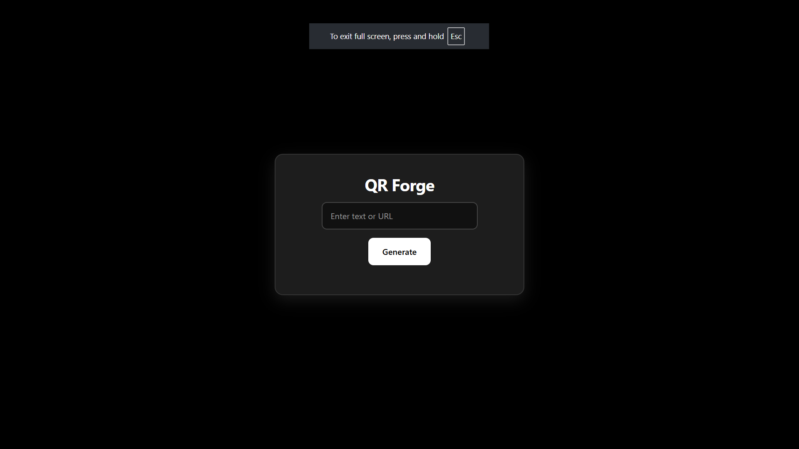
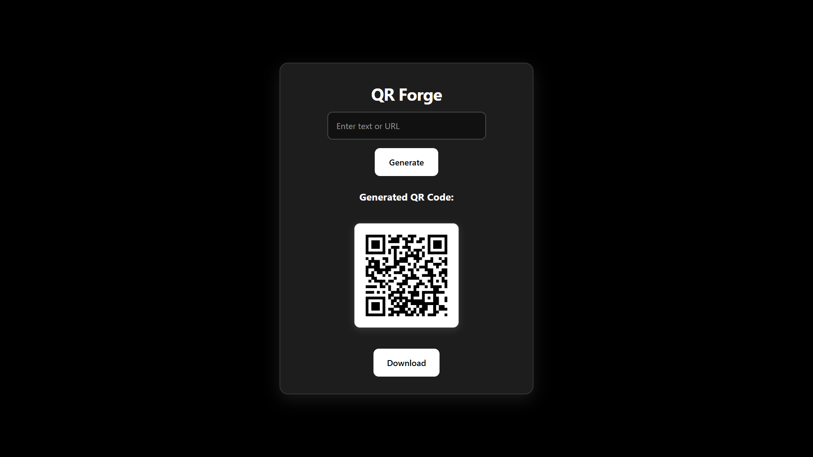

# 🔗 QR_Forge — QR Code Generator (Flask)

A lightweight QR code generator web app built with **Flask** and plain front-end.  
Generate, customize, and download QR codes quickly — ideal as a mini-project for portfolio & freelancing.

**Live demo:** [Link!](https://qr-forge.onrender.com) <!-- replace with your actual Render URL -->

---

## 🔍 What this repo contains
- `app.py` — Flask application (server-side routes & QR generation)  
- `templates/` — HTML templates (Jinja2)  
- `static/` — CSS, JS, images and client assets  
- `requirements.txt` — Python dependencies to install locally.  
*(Verified in repo files.)* :contentReference[oaicite:1]{index=1}

---

## ✨ Features (typical)
- Generate QR codes from text or URLs  
- Download QR as PNG (and optionally SVG)  
- Simple UI for input and customization (size, error correction, colors)  
- Mobile-friendly and fast — ready to extend

> If your app has any specific features (history, bulk generation, API endpoint), list them here.

---

## ⚙️ Run locally


1. Clone
```
git clone https://github.com/Yaswanth876/QR_Forge.git
cd QR_Forge
```
2. Create virtual environment & install
```
python -m venv venv
```
macOS / Linux
```
source venv/bin/activate
```
Windows
```
venv\Scripts\activate

pip install -r requirements.txt
```
3. Run the app
```
export FLASK_APP=app.py
export FLASK_ENV=development
flask run
```
or
```
python app.py
```
Open http://127.0.0.1:5000 in your browser
---

## 🚀 Deploying to Render

- Sign in to Render and create a New Web Service connected to this GitHub repo.

Use the following settings:

- Environment: Python 3
- Build Command: pip install -r requirements.txt
- Start Command: gunicorn app:app --bind 0.0.0.0:$PORT
- (If your Flask app object has a different name or uses app.run() only, use python app.py instead.)
- Add any environment variables in Render (e.g., SECRET_KEY) as needed.
- Deploy — Render will auto-build and publish your app. Replace the Live demo URL above with the Render URL Render provides.

---

### 📝 Notes & Next Steps (ideas)

- Add an API route to generate QR codes programmatically (useful for integrations)
- Add user history using localStorage or a small DB (SQLite)
- Add unit tests and CI, and enable HTTPS/headers via Render settings
- Optimize images and use a CDN for static assets

---

### 📸 Screenshots

Add screenshots to /static/screenshots/ and link them here:



---

### 📄 License
MIT License

---

### 👨‍💻 Author

**Yaswanth V** 
- B.E. CSE (AI & ML)
- [GitHub](https://github.com/Yaswanth876)
- [LinkedIn](www.linkedin.com/in/yaswanthv876)
Email: vsyaswanth008@gmail.com
